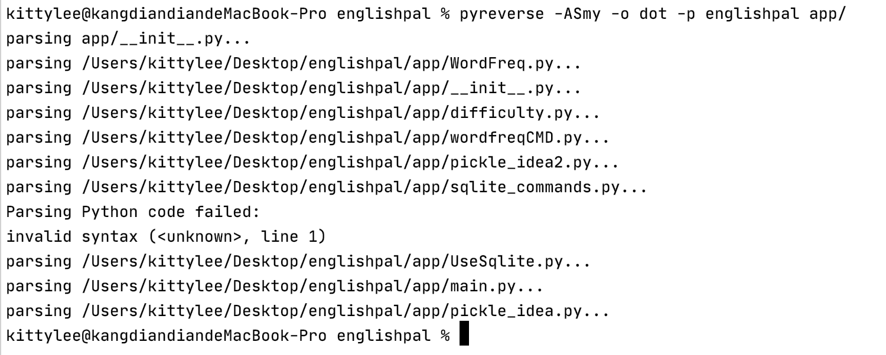
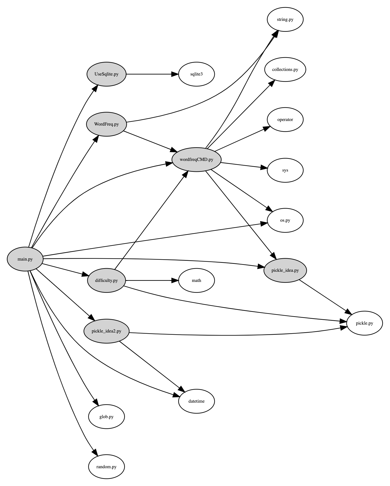
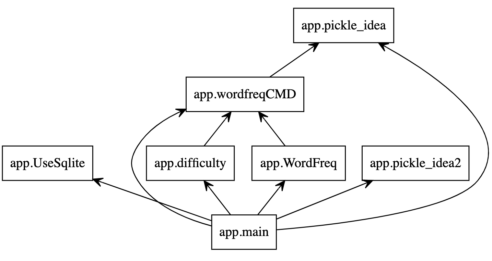
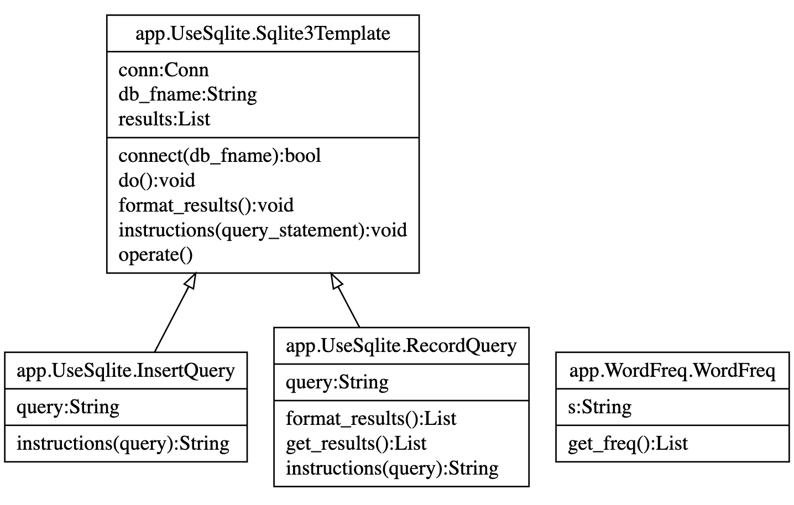
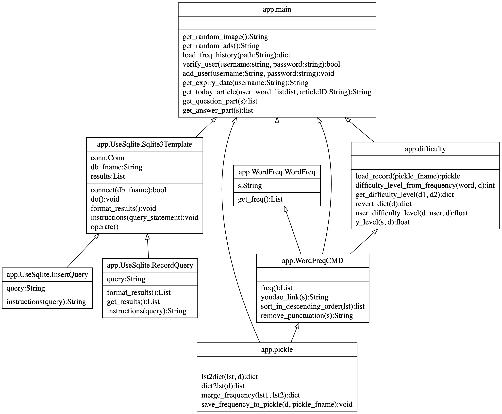

实验一: 依赖分析与依赖图
========================

.. raw:: html

   

作者：201836900206-李康恬、201836900203-陈佳瑛、

      201836900127-杨恺、201836000121-毛科捷

.. raw:: html

   

.. raw:: html

   

日期：2021/5/12  来源：浙江师范大学

.. raw:: html

   

摘要
------

在软件开发的过程中，我们需要设计编写许多模型架构，在使用HTTP
APIs帮助开发的过程中，为提高系统的健壮性，需要规避模块（或类）的依赖关系非常复杂的“Big
ball of mud”的情形。

此次实验，我们借助一些工具进行对EnglishPal项目依赖情况的研究，通过分析其模块与类的依赖关系，来理解项目的基本架构。实验中通过使用Snakefood、Graphviz及Pyreverse工具结合人工代码阅读得到依赖关系，生成依赖的dot文件，并使用Graphviz
Online工具将依赖图表绘制出来。

最终我们对项目的依赖关系进行分析得出结论，讨论得出项目各模块具有较好的依赖关系与可读性，但在封装上仍存在一定的不足，有待后续开发人员进行更好地调整改进。

介绍
------

Percival和Gregory在他们的《\ `Architecture Patterns with
Python`_\ 》一书中提到，耦合是一个令人讨厌的事情：它增加了更改代码的风险和成本，有时甚至使我们感到根本无法进行任何更改。而当项目的耦合达到一定程度对我们的系统造成困扰时，我们称这种情况为“Big
ball of mud”，书中对其如此描述：

*”随着应用程序的发展，如果我们无法防止没有内聚力的元素之间的耦合，那么这种耦合将以超线性的方式增加，直到我们不再能够有效地更改系统为止。“*

各种意义上，我们都希望我们的软件应用程序中避免使用和出现诸如\ `yarn-like
dependency`_\ 、\ `silkworm cocoon-like
dependency`_\ 和\ `anglerfish-like dependency`_\ 的“Big ball of
mud”项目依赖模式。

为学会如何绘制软件项目的依赖图以及进行更好的分析理解，了解体系结构，服务于未来项目的架构设计与开发维护过程中。我们以EnglishPal项目为对象，借助一些工具进行依赖图的绘制，在此基础上对其依赖关系进行分析，了解并梳理出当前系统项目的健康情况/健壮情况。

工具与方法
------------

工具
~~~~~~~~

-  `putty`_

-  Snakefood

-  Graphviz & Pyreverse

-  `Graphviz Online`_

-  `EnglishPal项目`_

-  Python 3

-  Windows System

方法
~~~~~~~~

利用Snakefood生成模型依赖关系
^^^^^^^^^^^^^^^^^^^^^^^^^^^^^

1. 安装putty后打开，在IP地址栏输入server的ip地址，点击打开后输入用户名与密码，登入server;

   .. image:: images/pic1.png

2. 登入后，通过\ ``git clone``\ 指令将EnglishPal项目代码下载下来，并通过\ ``cp``\ 指令将py文件复制到我们建立的文件夹中；

   .. image:: images/pic2.jpg

   .. image:: images/pic3.jpg

3. 复制完毕后\ ``cd``\ 到我们存放py的文件目录中，分别执行第一行，通过snakefood中的sfood工具，生成其依赖关系的dot文件，再执行\ ``less``\ 指令查看result.dot的文件内容，至此我们模型的依赖关系代码就自动地生成完毕。

   .. code:: shell

      $  sfood . | sfood-graph > result.dot
      $  less result.dot

   .. image:: images/pic4.png

利用Pyreverse生成模型依赖关系及类/方法依赖关系
^^^^^^^^^^^^^^^^^^^^^^^^^^^^^^^^^^^^^^^^^^^^^^

绘制方法参考知乎专栏： `Pyreverse结合Graphviz自动绘制Python类图`_，此处不予具体介绍展示。

生成依赖关系的代码如下，运行代码时终端的响应见下图。

.. code:: shell

   $  pyreverse -ASmy -o dot -p englishpal app/

利用Graphviz Online将dot文件绘制成图
^^^^^^^^^^^^^^^^^^^^^^^^^^^^^^^^^^^^

将生成的dot文件中的内容复制到Graphviz
Online的左侧页面中，页面右侧相应画出对应的依赖图，并设置输出的格式即Format，点击右侧页面中的图片即可保存。

结果
------

py文件之间的依赖：
~~~~~~~~~~~~~~~~~~~~~~~~

两张图分别为使用snakefood和pyreverse工具自动生成并用Graphviz Online绘制的模型依赖图。

可以看出snakefood绘制的会更清晰美观，且能包含在各py文件中\ ``import``\ 的python包；而pyreverse绘制的则更简洁的表示了项目中模型的依赖关系。两个工具各有利弊，但相对来说老师提供的会更加全面些。

通过观察我们可以知道各模型/py文件之间的关系：

-  main.py依赖于UseSqlite.py、difficulty.py、WordFreq.py、pickle_idea2.py和pickle_idea.py

-  difficulty.py和WordFreq.py都只依赖于WordFreqCMD.py

-  WordFreqCMD.py依赖于pickle_idea.py

-  UseSqlite.py、pickle_idea.py、pickle_idea2.py没有依赖于其他非库文件

而其中main.py依赖的py文件最多，而依赖于pickle_idea.py的py文件最多，这main.py在项目中占据重要控制地位，而pickle_idea.py在项目中为一个较重要的工具角色。通过后续观察各文件的内容，证明了main.py是一个执行功能文件，pickle_idea.py是一个底层基础的文件。包与包之间关系较好。

类图中的依赖：
~~~~~~~~~~~~~~~~~~~~

上示两图分别为我们通过pyreverse工具以及后期手动修正的类依赖图。pyreverse的自动生成功能可以看出，在我们的要求中并不特别适用于EnglishPal项目的类/方法依赖图绘制。

pyreverse其功能，我们简单概括可以理解为，它扫描读取各py文件中的class块并建立class之间的关系，也就是可以理解为进行纯类图的绘制。而我们的要求中，要求建立class/function即类/方法依赖图，即py函数中为被封装进类中的方法也要算入并进行绘制，因此pyreverse生成的dot文件并不完全，需要我们后期手动添加。

在这个层面上，我们团队认为该项目的封装抽象程度还存在一定的不足，需要更好的进行改进。

讨论
------

基于实验得出的依赖图，团队进行讨论，认为EnglishPal项目的结构有利有弊，简单列举如下：

-  优点：代码重用少，功能封装逻辑清晰，变量和方法命名准确使得代码可读性强，代码的结构分为大致三层，第一层为最底层，涉及到对数据库的最基本操作，第二层为功能层，将最底层的对数据库的操作进行组合封装以实现单独的功能，第三层也是最顶层，主要是main.py，他实现的是页面的加载和功能的调用。

-  缺点：顶层还是会调用底层模块，非相邻的两层间存在调用的情况，这在结构上并不完美。

团队认为该项目各模块之间功能分明，逻辑清晰，具有较好的可读性，但在封装上仍存在一定的不足，需要进行更好的改进。

参考资料
----------

-  开源书籍： `Harry Percival and Bob Gregory. Architecture Patterns with Python`_. O’Reilly Media; 1st edition (March 31, 2020).
-  知乎专栏： `Pyreverse结合Graphviz自动绘制Python类图`_

.. _Architecture Patterns with Python: https://www.cosmicpython.com/
.. _yarn-like dependency: https://thedailywtf.com/articles/Enterprise-Dependency-Big-Ball-of-Yarn
.. _silkworm cocoon-like dependency: https://thedailywtf.com/images/201101/DependencyGraph.png
.. _anglerfish-like dependency: https://thedailywtf.com/images/201103/tes0001.jpg
.. _putty: https://www.chiark.greenend.org.uk/~sgtatham/putty/
.. _Graphviz Online: https://dreampuf.github.io/GraphvizOnline/
.. _EnglishPal项目: https://github.com/lanlab-org/EnglishPal
.. _Harry Percival and Bob Gregory. Architecture Patterns with Python: https://www.cosmicpython.com/
.. _Pyreverse结合Graphviz自动绘制Python类图: https://zhuanlan.zhihu.com/p/365953969